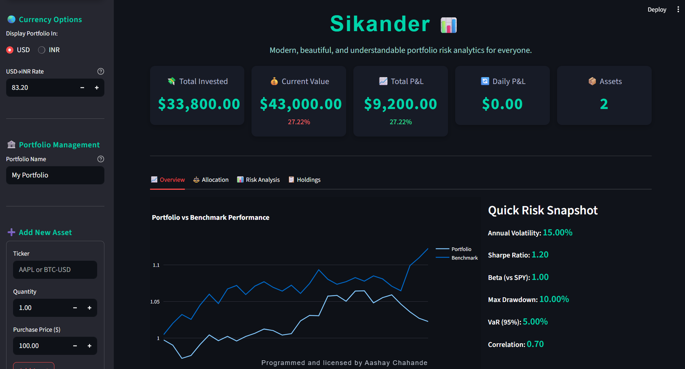

# 🚀 Sikander — Portfolio Risk & Analytics Dashboard


# Sikander

A sovereign asset and risk management system for the individual.
Sikander provides the strategic discipline of an institutional risk framework, scaled for a single portfolio. It is your automated sentry and strategist.

> **Strategy:** Simple Moving Average (SMA) Crossover  
> **Focus:** Automated execution with integrated position sizing.
>
> Inspired by the strategic might of its legendary namesake and the power of a hidden gem "Alladin" by BlackRock.

---

## What is Sikander?

Sikander is a sleek, modern app for tracking, visualizing, and understanding portfolio risk and performance. Invest in your future with data-driven clarity, powered by [Streamlit](https://streamlit.io), Plotly charts, and an intuitive dashboard. Perfect for beginners and seasoned investors alike 

<div align="center">
  
  <br><i>(Actual Sikander app screenshot)</i>
</div>

---

## ✨ Features

- 🪙 **Multi-currency portfolio:** Globally toggle all dashboards and analytics between USD ($) and INR (₹), with true Indian-style number formatting and digit grouping (e.g. 1,23,456.78)
- 📊 **Live Asset Tracking** — Stocks, ETFs, Crypto & more
- ⚡ **Lightning Fast Add/Edit/Delete** — Manage your holdings easily
- 📈 **Performance & Risk Visualization** — Cumulative returns, benchmarks, interactive charts
- 🧠 **Comprehensive Risk Metrics** — Volatility, Sharpe ratio, Max Drawdown, Value at Risk and more
- 🎨 **Beautiful, Responsive UI** — Card-style layouts, color-coded KPIs, modern themes
- 🖨️ **Exportable Holdings** — Download your up-to-date portfolio as CSV
- 🔐 **Local & Private** — All data runs in your browser, no cloud/upload required

---

## 🌏 New: INR Support

Sikander is now multi-currency! You can manage your portfolio and view analytics in either:
- 💲 **USD** — Standard US dollar (comma thousand separators)
- 🇮🇳 **INR** — Indian Rupee (₹), full Indian digit grouping (like 12,34,567.89)

### How to Use
- On the sidebar, choose between **USD** or **INR** display using the currency selector.
- Enter or adjust the live **USD→INR exchange rate** to convert all USD logic to INR for reporting and analytics.
- Add assets in either base—if using INR, the app internally converts your buy prices for perfect risk and return calculations.
- Every value, metric, and table will update instantly with the correct symbol and regional formatting.

<div align="center">
  
  <br/><i>Example: ₹1,23,456.00 or $12,345.00 — it's your choice.</i>
</div>

---

## 🚀 Getting Started

### 1. Clone or Download the Repo
```bash
git clone https://github.com/your-username/sikander.git
cd sikander
```

### 2. Install Requirements
```bash
pip install -r requirements.txt
```
*Supports Python 3.9/3.10/3.11/3.12 (recommended: 3.11+)*

### 3. Launch the App
```bash
streamlit run app.py
```
*It will open in your browser at http://localhost:8501 by default.*

---

## 🌟 How to Use Sikander

1. 🧰 **Setup** — Name your portfolio, start adding assets with symbol (like `AAPL`, `SPY`, `BTC-USD`), quantity, and price (now in USD or INR as selected).
2. 🌍 **Currency Toggle** — Instantly switch currency modes (USD/INR) in sidebar; adjust the USD/INR rate to match the live market anytime.
3. ⚡ **Quick Add** — Use sidebar categories for instant asset addition.
4. 📈 **View Performance** — Explore Overview and Allocation tabs for growth & balance.
5. 🧠 **Analyze Risk** — See professional risk metrics, read one-line explanations to learn.
6. 📋 **Manage Holdings** — Edit or remove assets at any time, export as CSV when needed.


---

## Example

```bash
streamlit run app.py
```
- Open the sidebar, hit "Add Asset", enter AAPL, quantity, and price (use either currency!).
- Explore charts & metrics for your personal portfolio — switch the global toggle to see all values update to INR or USD instantly.
- Curious? Hover/click any metric or section for explanations!

---

## 🤝 Credits & License

- Programmed and licensed by **Aashay Chahande**
- 
- **GNU GENERAL PUBLIC LICENSE
  Version 3, 29 June 2007**

For questions or suggestions: [Aashay's GitHub](https://github.com/)

---

## 💡 FAQ / User Tips

- For the best visuals, use Chrome/Brave/Edge modern browsers.
- Switch between USD/INR at any time — all numbers update live without a reload.
- Data shown is local and purely for demonstration—no real trades.
- If something looks "off", hit refresh or re-run; all analytics recalc instantly.
- Portfolio and risk analytics are for education; consult your advisor before investing!

---

<div align="center">
  <sub>Programmed and licensed by <b>Aashay Chahande</b> — Sikander Project, 2025</sub>
</div>
